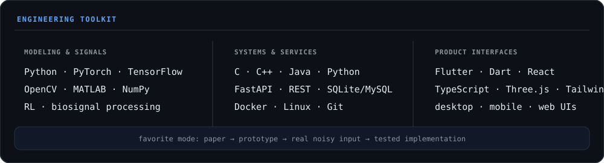

> **I build intelligent systems that have to agree with the world outside the notebook.**
>
> AI Engineering undergraduate at **Amrita Vishwa Vidyapeetham**, working across reinforcement learning, motion capture, computer vision, and EEG biosignals. My work starts with a question, continues through imperfect real-world data, and ends in something people can run.

## Selected work

<table>
  <tr>
    <td width="50%" valign="top">
      <h3><a href="https://github.com/ManoharPaturi/mocap">mocapX1 ↗</a></h3>
      MARKERLESS MOTION INTELLIGENCE
        
      MediaPipe pose, stereo DLT triangulation, filtering, joint kinematics, live visualization, and motion-capture exports in one offline-first pipeline.
        
      <code>Python</code> <code>FastAPI</code> <code>React</code> <code>Three.js</code>
    </td>
    <td width="50%" valign="top">
      <h3><a href="https://github.com/ManoharPaturi/TIC-TAC-TOE-Player-By-DOUBLE-DQN-MODEL">Self-play RL ↗</a></h3>
      DECISION SYSTEMS FROM FIRST PRINCIPLES
        
      A Double/Dueling DQN agent with NoisyNet exploration and prioritized replay, trained by self-play and compared against a minimax baseline.
        
      <code>Python</code> <code>PyTorch</code> <code>Reinforcement learning</code>
    </td>
  </tr>
  <tr>
    <td width="50%" valign="top">
      <h3><a href="https://github.com/ManoharPaturi/D9_MFC4_SVD-BASED-NOISE-REDUCTION-IN-EEG-SIGNALS-">EEG denoising ↗</a></h3>
      BIOSIGNAL RECOVERY
        
      SVD-based EOG artifact removal for real 14-channel Emotiv EPOC X recordings—separating measurement artifacts from neural structure.
        
      <code>MATLAB</code> <code>SVD</code> <code>Signal processing</code>
    </td>
    <td width="50%" valign="top">
      <h3><a href="https://github.com/ManoharPaturi/projX">projX ↗</a></h3>
      ON-DEVICE COMPUTER VISION
        
      A mobile OMR evaluation workflow that captures sheets, detects bubbles with OpenCV, matches answer keys, and exports results without a server round trip.
        
      <code>Flutter</code> <code>Dart</code> <code>OpenCV</code>
    </td>
  </tr>
</table>

[Explore all repositories →](https://github.com/ManoharPaturi?tab=repositories)

## Upstream contributions

I look for the place where a small, precise change removes a real developer paper-cut—then add the regression test or documentation correction that keeps it fixed.

<table>
  <tr>
    <td width="18%" valign="top">MERGED <b>AstryX</b></td>
    <td width="62%">Added an <code>elevation</code> prop to <code>ToggleButton</code>.</td>
    <td width="20%" align="right"><a href="https://github.com/facebook/astryx/pull/6037">PR #6037 ↗</a></td>
  </tr>
  <tr>
    <td valign="top">MERGED <b>LangChain</b></td>
    <td>Removed stale parameter and exception documentation from public APIs.</td>
    <td align="right"><a href="https://github.com/langchain-ai/langchain/pull/40211">PR #40211 ↗</a></td>
  </tr>
  <tr>
    <td valign="top">MERGED <b>MuJoCo</b></td>
    <td>Corrected misleading terminology in physics-engine reference docs.</td>
    <td align="right"><a href="https://github.com/google-deepmind/mujoco/pull/3550">PR #3550 ↗</a></td>
  </tr>
  <tr>
    <td valign="top">MERGED <b>Mistral AI</b></td>
    <td>Fixed an error in the experimental usage guide.</td>
    <td align="right"><a href="https://github.com/mistralai/mistral-common/pull/306">PR #306 ↗</a></td>
  </tr>
</table>

Active reviews currently cover NeMo, vLLM, Weaviate, and Claude Code Action · <a href="https://github.com/pulls?q=is%3Apr+author%3AManoharPaturi">open the full contribution ledger →</a>

## Toolkit

## Live signal

&nbsp;

 

### Let’s build something that has to work in the real world.

[Email](mailto:manoharpaturi777@gmail.com) · [LinkedIn](https://linkedin.com/in/manoharpaturi) · [Repositories](https://github.com/ManoharPaturi?tab=repositories)

A living research log — updated nightly with versioned, self-contained graphics.

