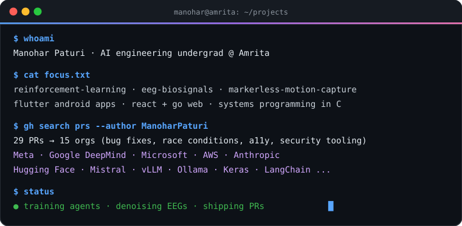
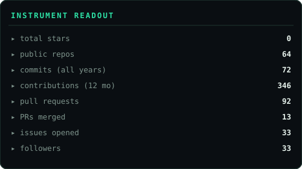
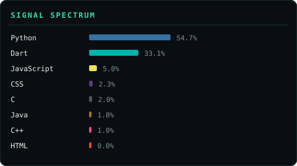
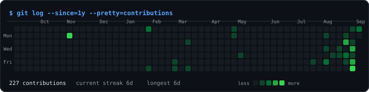

  

   
  
  &nbsp;
  
  &nbsp;
  
  &nbsp;
  

 

---

## `$ cat principles.md`

> A bug I can't reproduce is a rumor. Repro it on pristine code first — *then* ship the smallest diff that kills it.

> Small diffs open big doors. A three-line fix can land you inside an 80k-star codebase.

> Trust verified code, not clout.

> Read the issue twice. Claim it once. Ship within the hour.

---

## `$ gh pr list --author @me --state=all`

The scoreboard — **27+ pull requests across 15 orgs**: concurrency bugs, a11y gaps, inference & DX fixes, security tooling. Two merged and counting.

### highlights

| where | what I shipped | PR | |
|-------|----------------|----|-|
| **Meta** · [astryx](https://github.com/facebook/astryx) | `elevation` prop for `ToggleButton` — went through the full review loop with Meta's design-system team | [#6037](https://github.com/facebook/astryx/pull/6037) | 🟣 merged |
| **Meta** · astryx | guard `TextInput.onEnter` against Japanese-IME conversion commits | [#6083](https://github.com/facebook/astryx/pull/6083) | 🟢 open |
| **Meta** · astryx | 44px touch-target floor for `SegmentedControlItem` on coarse pointers | [#6084](https://github.com/facebook/astryx/pull/6084) | 🟢 open |
| **Meta** · astryx | scope the 16px input font floor to iOS only | [#6085](https://github.com/facebook/astryx/pull/6085) | 🟢 open |
| **Meta** · astryx | type-scale-aware `TextInput`/`TextArea` + new theme target | [#6086](https://github.com/facebook/astryx/pull/6086) | 🟢 open |
| **deepset** · [haystack](https://github.com/deepset-ai/haystack) | cross-batch write–write conflicts in the agent tool scheduler now resolve by LLM call order 🚀 | [#12628](https://github.com/deepset-ai/haystack/pull/12628) | 🟢 open |
| **Keras** | `-inf` gradients in `normalize()` for float16 — L2 norm computed in float32 | [#23566](https://github.com/keras-team/keras/pull/23566) | 🟢 open |
| **vLLM** | install `numactl` in ROCm images so `--numa-bind` isn't a silent no-op | [#55433](https://github.com/vllm-project/vllm/pull/55433) | 🟢 open |
| **Ollama** | normalize escaped pattern literals in tool/format schemas at the `llama-server` boundary | [#18248](https://github.com/ollama/ollama/pull/18248) | 🟢 open |
| **Microsoft** · autogen | reject stale hunks in `TextCanvas.apply_patch` with context validation | [#8195](https://github.com/microsoft/autogen/pull/8195) | 🟢 open |
| **Microsoft** · PyRIT | Garak exploitation scenario — Jinja template injection + SQLi echo | [#2576](https://github.com/microsoft/PyRIT/pull/2576) | 🟢 open |
| **Anthropic** · claude-code-action | skip malformed buffered comment lines instead of failing the CI post step | [#1797](https://github.com/anthropics/claude-code-action/pull/1797) | 🟢 open |
| **ComfyUI** | mask-editor painted uploads no longer destroy the original image under the mask | [#16141](https://github.com/Comfy-Org/ComfyUI/pull/16141) | 🟢 open |
| **LangChain** | removed stale `Args`/`Raises` docstrings from core callbacks/generation | [#40211](https://github.com/langchain-ai/langchain/pull/40211) | 🟣 merged |

<b>…and the rest of the board</b> (transformers, weaviate, mujoco, datasets, mistral-common, aws-cdk, lm-eval-harness)

| where | what I shipped | PR | |
|-------|----------------|----|-|
| [huggingface/transformers](https://github.com/huggingface/transformers) | skip the symlinked hub-cache test on platforms that can't create symlinks | [#48530](https://github.com/huggingface/transformers/pull/48530) | 🟢 open |
| [weaviate/weaviate](https://github.com/weaviate/weaviate) | fix `object_count` Prometheus help text (copy-pasted from `async_operations_running`) | [#12951](https://github.com/weaviate/weaviate/pull/12951) | 🟢 open |
| [weaviate/weaviate](https://github.com/weaviate/weaviate) | docs: add `rq-4` to `ALLOWED_COMPRESSION_TYPES` valid entries | [#12950](https://github.com/weaviate/weaviate/pull/12950) | 🟢 open |
| [google-deepmind/mujoco](https://github.com/google-deepmind/mujoco) | fix inconsistent axis labels in `solimp` documentation figures | [#3548](https://github.com/google-deepmind/mujoco/pull/3548) | 🟢 open |
| [google-deepmind/mujoco](https://github.com/google-deepmind/mujoco) | documentation typo sweep | [#3550](https://github.com/google-deepmind/mujoco/pull/3550) | 🟢 open |
| [microsoft/autogen](https://github.com/microsoft/autogen) | docs typo sweep — 16 files | [#8196](https://github.com/microsoft/autogen/pull/8196) | 🟢 open |
| [aws/aws-cdk](https://github.com/aws/aws-cdk) | drop stale `sep` reference from `ArnComponents.arnFormat` default docs | [#38775](https://github.com/aws/aws-cdk/pull/38775) | 🟢 open |
| [ollama/ollama](https://github.com/ollama/ollama) | log the provenance of the loaded context length | [#18249](https://github.com/ollama/ollama/pull/18249) | 🟢 open |
| [Comfy-Org/ComfyUI](https://github.com/Comfy-Org/ComfyUI) | fix Trellis2 `UppsampleStage` hardcoded `lr_resolution` for 64-grid decodes | [#16114](https://github.com/Comfy-Org/ComfyUI/pull/16114) | 🟢 open |
| [EleutherAI/lm-evaluation-harness](https://github.com/EleutherAI/lm-evaluation-harness) | verified typo fixes across 16 task docs | [#4102](https://github.com/EleutherAI/lm-evaluation-harness/pull/4102) | 🟢 open |
| [facebook/astryx](https://github.com/facebook/astryx) | render plain `Link` anchors inline so ancestor `Text` clamps can truncate them | [#6038](https://github.com/facebook/astryx/pull/6038) | 🟢 open |
| [anthropics/claude-code-action](https://github.com/anthropics/claude-code-action) | extract the user request only from word-boundary trigger occurrences | [#1799](https://github.com/anthropics/claude-code-action/pull/1799) | 🟢 open |
| [huggingface/datasets](https://github.com/huggingface/datasets) | fix typo in guide template | [#8567](https://github.com/huggingface/datasets/pull/8567) | 🟢 open |
| [mistralai/mistral-common](https://github.com/mistralai/mistral-common) | docs typo fix in the experimental usage guide | [#306](https://github.com/mistralai/mistral-common/pull/306) | 🟢 open |

---

## `$ cat focus.txt`

- 🧠 **reinforcement learning** — Double/Dueling DQN, NoisyNets, prioritized replay, self-play training
- 🩺 **biosignal processing** — EEG artifact removal & reconstruction (SVD, ADMM, graph signal processing) on real Emotiv EPOC X recordings
- 🎥 **markerless motion capture** — MediaPipe pose → stereo DLT triangulation → kinematics → C3D/BVH exports, live 3D dashboards
- 📱 **Android · Flutter** — offline-first mobile apps with on-device OpenCV; my OMR grader never needs a server
- 🌐 **full-stack** — React + Go platforms, FastAPI + React/Three.js app UIs, Spring REST backends over MySQL
- 🖥️ **systems** — POSIX-level C, GTK, raw syscalls

---

## `$ ls -la ~/projects`

One project per problem domain — each chosen because the interesting part is the underlying subject, not the boilerplate around it.

| domain | project | what's under the hood |
|--------|---------|----------------------|
| 🧠 **reinforcement learning** | [**Tic-Tac-Toe × Double DQN**](https://github.com/ManoharPaturi/TIC-TAC-TOE-Player-By-DOUBLE-DQN-MODEL) | Double Q-learning targets (overestimation bias fix) + dueling value/advantage streams + NoisyNet exploration + prioritized replay — every trick implemented from its paper, trained purely by self-play |
| ⚡ **dynamical systems** | [**DMD power oscillations**](https://github.com/ManoharPaturi/dmd-) | Regularized Dynamic Mode Decomposition on 29-generator PMU recordings — recovers oscillation-mode frequency, damping ratio and generator participation factors |
| 🩺 **biomedical signals** | [**SVD EEG denoising**](https://github.com/ManoharPaturi/D9_MFC4_SVD-BASED-NOISE-REDUCTION-IN-EEG-SIGNALS-) | EOG artifacts isolated as a low-rank subspace of real Emotiv EPOC X recordings via SVD — reproducing Sadasivan & Dutt (1996) |
| 🎥 **3D vision · biomechanics** | [**mocapX1**](https://github.com/ManoharPaturi/manu_mocap) | Markerless motion capture end-to-end — pose → stereo DLT triangulation → filtering → joint kinematics → JSON/CSV/TRC/C3D/BVH exports, with a FastAPI + Three.js web UI |
| 🧬 **graph theory · bioinformatics** | [**T1D protein network**](https://github.com/ManoharPaturi/bio-analysis) | Degree / betweenness / closeness centrality over the Type-1-Diabetes protein interactome from STRING data — ranks candidate hub genes with NetworkX |
| 🔌 **computer networks** | [**OSI model simulator**](https://github.com/ManoharPaturi/OSI-Model-Stimulation-in-python) | Five networked processes (clients, switch, router, server) passing real socket traffic through hand-built per-layer encapsulation/decapsulation |
| 🖥️ **systems programming** | [**File manager on raw syscalls**](https://github.com/ManoharPaturi/File-Management-System-Using-Basic-System-Calls-in-C) | Dual-pane GTK3 file manager where listing, copy, recursive delete and zip run directly on POSIX system calls + libzip — no stdio file wrappers |
| 📱 **mobile · Android** | [**projX — OMR evaluation**](https://github.com/ManoharPaturi/projX) | Android-first Flutter app that grades OMR answer sheets **fully offline** — camera capture → on-device OpenCV bubble detection → versioned answer keys → PDF/XLSX marksheets. The sheet layout is authored once in mm and compiles to both the print PDF and the detection grid, so print-vs-detection drift is impossible by construction |
| 🌐 **full-stack · client–server** | [**SRMS seating**](https://github.com/ManoharPaturi/Seating-Arrangement-) | Seat & venue reservation built twice over one shared domain model — a Java Swing desktop client and a Spring REST API, both against MySQL persistence |

<b>more on the shelf</b>

- [VS7.1 mocap](https://github.com/ManoharPaturi/mocap_mac) — dual-laptop real-time multi-person capture with stereo 3D reconstruction, kinematics engine & validation pipeline
- [MOCAP_MANU](https://github.com/ManoharPaturi/MOCAP_MANU) — EasyMocap + SMPL monocular body fitting with an upload-to-analyze web app
- [C Data Structures](https://github.com/ManoharPaturi/Basic-Datastructures-implementation-in-C-) — header-only C++17 heaps, BSTs, graphs with BFS/DFS, each with an interactive demo
- [Chef Tony](https://github.com/ManoharPaturi/Chatbot-for-recepies-with-images) — Gemini 2.0 Flash recipe chatbot that finds its own dish photos

> 🔨 currently building (private): **SchoolMate** — a school-management platform (React + Go + SQLite) that pairs with projX.

---

## `$ which -a`

**languages**

**apps & frameworks**

**AI · CV · signals**

**infra & data**

---

## `$ history | tail -6`

| when | what happened |
|------|---------------|
| `2024.12` | first repo pushed — then straight into the deep end: GTK file manager on raw POSIX syscalls |
| `2025` | the coursework core — self-play Double DQN, OSI simulator on real sockets, DMD on power-grid data, PPI network analysis, SRMS client/server |
| `2026.01 → 03` | biosignals & mocap era — SVD EEG denoising on real recordings, VS7.1 dual-laptop stereo capture, SMPL body fitting |
| `2026.08` | **mocapX1** — the whole capture-to-C3D pipeline consolidated into one repo |
| `2026.09` | OSS campaign — 27+ PRs across 15 orgs; first **Meta** merge (astryx #6037) + **LangChain** #40211 |
| `next` | projX v1 + SchoolMate · hunting Summer 2027 research internships |

---

## `$ uptime`

- 📍 **where** — 3rd-year B.Tech CSE(AI) @ Amrita Coimbatore, class of 2028
- 🔨 **building** — SchoolMate (React + Go + SQLite) · projX capture presets
- 🏹 **in review queues** — five PRs @ Meta astryx · flagship scheduler fix @ deepset/haystack
- 🎯 **hunting** — Summer 2027 AI/ML research internships
- 📚 **reading** — Koopman-operator methods · EEG source reconstruction

---

## `$ cat /dev/random`

- my motion-capture lab is two laptops, a phone tripod and a suspicious amount of tape
- I trained a Double DQN to never lose tic-tac-toe — then wrote a minimax player to prove it; they draw forever
- projX grades NEET-density OMR sheets (180 questions, 4 columns) from a plain 12 MP phone camera, fully offline
- I've shipped fixes into repos with more stars than I have followers — working on flipping that ratio too
- the EEG denoisers run on real Emotiv EPOC X recordings, not textbook CSVs

---

## `$ git log --stat`

  
  &nbsp;
  

  

everything above is generated by <a href="https://github.com/ManoharPaturi/ManoharPaturi/blob/main/scripts/gen_stats.py"><code>scripts/gen_stats.py</code></a> — a tiny GitHub Action re-runs it against the GitHub API daily and rewrites the SVGs in place. No third-party card service, no broken images, no rate limits.

---

## `$ finger manohar`

📬 **manoharpaturi777@gmail.com** — open to research internships (AI/ML, Summer 2027), OSS collaborations and interesting problems

&nbsp;

 

$ exit 👋

