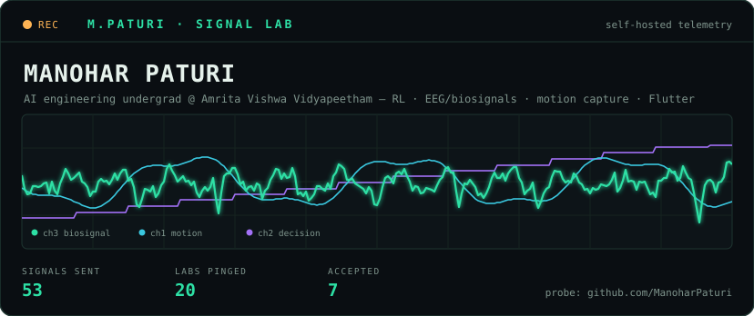
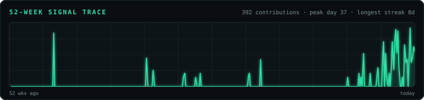

 

  

I build systems that meet cameras, electrodes, users, and imperfect inputs as they actually are — AI engineering undergrad @ Amrita Vishwa Vidyapeetham.

 

every card on this page is hand-built SVG, regenerated nightly from public GitHub data. no third-party widgets.

---

## ch.01 · ship log

I contribute upstream where a small, precise change removes a real developer paper-cut — then add the regression test or documentation that keeps it fixed.

<table>
  <tr>
    <td width="34%" valign="top"></td>
    <td width="66%" valign="top">

**accepted upstream**

| lab | what shipped | pr | state |
|-------|----------------|----|-------|
| **Meta** · [astryx](https://github.com/facebook/astryx) | `elevation` prop for `ToggleButton` — survived Meta's full design-system review loop | [#6037](https://github.com/facebook/astryx/pull/6037) | 🟣 merged |
| **Google DeepMind** · [mujoco](https://github.com/google-deepmind/mujoco) | corrected misleading terminology in the physics-engine reference docs | [#3550](https://github.com/google-deepmind/mujoco/pull/3550) | 🟣 merged |
| **LangChain** · [langchain](https://github.com/langchain-ai/langchain) | removed stale `Args` / `Raises` docstrings from core public APIs | [#40211](https://github.com/langchain-ai/langchain/pull/40211) | 🟣 merged |
| **Mistral AI** · [mistral-common](https://github.com/mistralai/mistral-common) | fixed an error in the experimental usage guide | [#306](https://github.com/mistralai/mistral-common/pull/306) | 🟣 merged |

</td>
  </tr>
</table>

**in review — 34 signals awaiting a verdict**

| lab | what i shipped | pr | state |
|-------|----------------|----|-------|
| **Meta** · astryx | guard `TextInput.onEnter` against Japanese-IME conversion commits | [#6083](https://github.com/facebook/astryx/pull/6083) | 🟢 open |
| **Meta** · astryx | scale `TextInput`/`TextArea` control type with size + new theme target | [#6086](https://github.com/facebook/astryx/pull/6086) | 🟢 open |
| **deepset** · haystack | cross-batch write–write conflicts in the agent tool scheduler now resolve by LLM call order | [#12628](https://github.com/deepset-ai/haystack/pull/12628) | 🟢 open |
| **Keras** | `-inf` gradients in `normalize()` for float16 — L2 norm computed in float32 | [#23566](https://github.com/keras-team/keras/pull/23566) | 🟢 open |
| **vLLM** | install `numactl` in ROCm images so `--numa-bind` isn't a silent no-op | [#55433](https://github.com/vllm-project/vllm/pull/55433) | 🟢 open |
| **Ollama** | normalize escaped pattern literals in tool/format schemas at the `llama-server` boundary | [#18248](https://github.com/ollama/ollama/pull/18248) | 🟢 open |
| **Microsoft** · autogen | reject stale hunks in `TextCanvas.apply_patch` with context validation | [#8195](https://github.com/microsoft/autogen/pull/8195) | 🟢 open |
| **Microsoft** · PyRIT | Garak exploitation scenario — Jinja template injection + SQLi echo | [#2576](https://github.com/microsoft/PyRIT/pull/2576) | 🟢 open |
| **Anthropic** · claude-code-action | skip malformed buffered comment lines instead of failing the CI post step | [#1797](https://github.com/anthropics/claude-code-action/pull/1797) | 🟢 open |
| **NVIDIA** · Megatron-Bridge | in-process HashStore for `temporary_distributed_context` rendezvous | [#5989](https://github.com/NVIDIA-NeMo/Megatron-Bridge/pull/5989) | 🟢 open |
| **NVIDIA** · Speech | repair `ConvSubsampling` forward paths missed by the `MaskedConvSequential` refactor | [#16225](https://github.com/NVIDIA-NeMo/Speech/pull/16225) | 🟢 open |
| **NVIDIA** · DataDesigner | tolerate literal braces in prompt validation (valid Jinja text) | [#923](https://github.com/NVIDIA-NeMo/DataDesigner/pull/923) | 🟢 open |

<b>rest of the board</b> — 22 more across astryx, NeMo Run/Curator/Speech, transformers, weaviate, mujoco, datasets, aws-cdk, ComfyUI, lm-eval-harness, autogen, ollama

| lab | what i shipped | pr | state |
|-------|----------------|----|-------|
| [facebook/astryx](https://github.com/facebook/astryx) | floor `SegmentedControlItem` to a 44px touch target on coarse pointers | [#6084](https://github.com/facebook/astryx/pull/6084) | 🟢 open |
| [facebook/astryx](https://github.com/facebook/astryx) | scope the 16px input font floor to iOS only | [#6085](https://github.com/facebook/astryx/pull/6085) | 🟢 open |
| [facebook/astryx](https://github.com/facebook/astryx) | render plain `Link` anchors inline so ancestor `Text` clamps can truncate them | [#6038](https://github.com/facebook/astryx/pull/6038) | 🟢 open |
| [NVIDIA-NeMo/Run](https://github.com/NVIDIA-NeMo/Run) | only treat delimited run/executor/plugins prefixes as overwrites | [#605](https://github.com/NVIDIA-NeMo/Run/pull/605) | 🟢 open |
| [NVIDIA-NeMo/Run](https://github.com/NVIDIA-NeMo/Run) | handle unparameterized list/dict annotations in the CLI value parser | [#607](https://github.com/NVIDIA-NeMo/Run/pull/607) | 🟢 open |
| [NVIDIA-NeMo/Run](https://github.com/NVIDIA-NeMo/Run) | forward entrypoint `skip_confirmation` to the generated command | [#609](https://github.com/NVIDIA-NeMo/Run/pull/609) | 🟢 open |
| [NVIDIA-NeMo/Run](https://github.com/NVIDIA-NeMo/Run) | remove stray "Configuring global options" debug print | [#611](https://github.com/NVIDIA-NeMo/Run/pull/611) | 🟢 open |
| [NVIDIA-NeMo/Megatron-Bridge](https://github.com/NVIDIA-NeMo/Megatron-Bridge) | allow Energon native sequence packing with MTP | [#5990](https://github.com/NVIDIA-NeMo/Megatron-Bridge/pull/5990) | 🟢 open |
| [NVIDIA-NeMo/Curator](https://github.com/NVIDIA-NeMo/Curator) | treat `DocumentSplitter` separator as a literal string | [#2376](https://github.com/NVIDIA-NeMo/Curator/pull/2376) | 🟢 open |
| [NVIDIA-NeMo/Curator](https://github.com/NVIDIA-NeMo/Curator) | fix `split_large_files` RecursionError on single rows larger than target size | [#2377](https://github.com/NVIDIA-NeMo/Curator/pull/2377) | 🟢 open |
| [NVIDIA-NeMo/Speech](https://github.com/NVIDIA-NeMo/Speech) | `SubsamplingReductionModule` pooling computes lengths for a single `MaxPool1d` pass | [#16226](https://github.com/NVIDIA-NeMo/Speech/pull/16226) | 🟢 open |
| [anthropics/claude-code-action](https://github.com/anthropics/claude-code-action) | extract the user request only from word-boundary trigger occurrences | [#1799](https://github.com/anthropics/claude-code-action/pull/1799) | 🟢 open |
| [huggingface/transformers](https://github.com/huggingface/transformers) | skip the symlinked hub-cache test on platforms that can't create symlinks | [#48530](https://github.com/huggingface/transformers/pull/48530) | 🟢 open |
| [huggingface/datasets](https://github.com/huggingface/datasets) | fix typo in guide template | [#8567](https://github.com/huggingface/datasets/pull/8567) | 🟢 open |
| [weaviate/weaviate](https://github.com/weaviate/weaviate) | fix `object_count` Prometheus help text (copy-pasted from `async_operations_running`) | [#12951](https://github.com/weaviate/weaviate/pull/12951) | 🟢 open |
| [weaviate/weaviate](https://github.com/weaviate/weaviate) | docs: add `rq-4` to `ALLOWED_COMPRESSION_TYPES` valid entries | [#12950](https://github.com/weaviate/weaviate/pull/12950) | 🟢 open |
| [aws/aws-cdk](https://github.com/aws/aws-cdk) | drop stale `sep` reference from `ArnComponents.arnFormat` default docs | [#38775](https://github.com/aws/aws-cdk/pull/38775) | 🟢 open |
| [Comfy-Org/ComfyUI](https://github.com/Comfy-Org/ComfyUI) | mask-editor painted uploads no longer destroy the original image under the mask | [#16141](https://github.com/Comfy-Org/ComfyUI/pull/16141) | 🟢 open |
| [google-deepmind/mujoco](https://github.com/google-deepmind/mujoco) | fix inconsistent axis labels in `solimp` documentation figures | [#3548](https://github.com/google-deepmind/mujoco/pull/3548) | 🟢 open |
| [EleutherAI/lm-evaluation-harness](https://github.com/EleutherAI/lm-evaluation-harness) | verified typo fixes across 16 task docs | [#4102](https://github.com/EleutherAI/lm-evaluation-harness/pull/4102) | 🟢 open |
| [microsoft/autogen](https://github.com/microsoft/autogen) | docs typo sweep — 16 files | [#8196](https://github.com/microsoft/autogen/pull/8196) | 🟢 open |
| [ollama/ollama](https://github.com/ollama/ollama) | log the provenance of the loaded context length | [#18249](https://github.com/ollama/ollama/pull/18249) | 🟢 open |

[explore every upstream pull request →](https://github.com/pulls?q=is%3Apr+author%3AManoharPaturi)

---

## ch.02 · specimens

<b>SPX-01 · MOTION</b> — markerless motion capture

**friction:** useful motion capture still lives in laboratories — special suits, special cameras, special rooms.

**approach:** connect two ordinary camera views through MediaPipe pose landmarks, triangulate with stereo DLT, filter the trajectory, and derive joint kinematics instead of stopping at landmarks.

**proof:** an offline-first pipeline with live 3D inspection and motion-capture export formats.

<code>Python</code> <code>FastAPI</code> <code>React</code> <code>Three.js</code> <code>OpenCV</code>

[open the case file ↗](https://github.com/ManoharPaturi/mocap)

<b>SPX-02 · DECISIONS</b> — self-play reinforcement learning

**friction:** "the agent learned something" is not evidence unless the learning is tested against a known-optimal opponent.

**approach:** train a Double/Dueling DQN agent with NoisyNet exploration and prioritized experience replay, then confront it with self-play pressure and a minimax baseline.

**proof:** the system exposes both the learned policy and the sanity check — not just the exciting score.

<code>Python</code> <code>PyTorch</code> <code>reinforcement learning</code>

[open the case file ↗](https://github.com/ManoharPaturi/TIC-TAC-TOE-Player-By-DOUBLE-DQN-MODEL)

<b>SPX-03 · BIOSIGNALS</b> — EEG artifact recovery

**friction:** real EEG is eye movement, muscle activity, electrode noise — and somewhere in there, the neural signal.

**approach:** use SVD to separate low-rank artifact structure from the underlying 14-channel Emotiv EPOC X recordings rather than pretending the acquisition was sterile.

**proof:** denoising treated as signal recovery, with the assumptions made visible.

<code>MATLAB</code> <code>SVD</code> <code>signal processing</code>

[open the case file ↗](https://github.com/ManoharPaturi/D9_MFC4_SVD-BASED-NOISE-REDUCTION-IN-EEG-SIGNALS-)

<b>SPX-04 · ON-DEVICE VISION</b> — projX OMR grading

**friction:** document evaluation often becomes "upload everything to a server and wait."

**approach:** keep capture, bubble detection, answer-key comparison, and result export on the mobile device.

**proof:** a complete grading workflow that works without a server round trip.

<code>Flutter</code> <code>Dart</code> <code>OpenCV</code>

[open the case file ↗](https://github.com/ManoharPaturi/projX)

<b>SPX-05 · SYSTEMS</b> — POSIX file manager

**friction:** abstractions hide what the machine actually does.

**approach:** a file manager built directly on raw POSIX system calls — every operation mapped to its visible syscall boundary, no convenience layers.

**proof:** know what's underneath your abstractions.

<code>C</code> <code>POSIX</code> <code>system calls</code>

[open the case file ↗](https://github.com/ManoharPaturi/File-Management-System-Using-Basic-System-Calls-in-C)

---

## ch.03 · calibration notes

> Build it from scratch at least once — the magic disappears, the understanding stays.
>
> If you can't reproduce it, you don't understand it yet.
>
> Real data over clean examples — messy input teaches what tutorials hide.
>
> Know what's underneath your abstractions. They all leak eventually.

---

## ch.04 · instrument bench

&nbsp;

  

---

## ch.05 · ground control

 

### Bring me a signal that refuses to behave.

[Email](mailto:manoharpaturi777@gmail.com) · [LinkedIn](https://linkedin.com/in/manoharpaturi) · [Repositories](https://github.com/ManoharPaturi?tab=repositories)

a self-updating instrument · hero + telemetry regenerated nightly from public GitHub data

