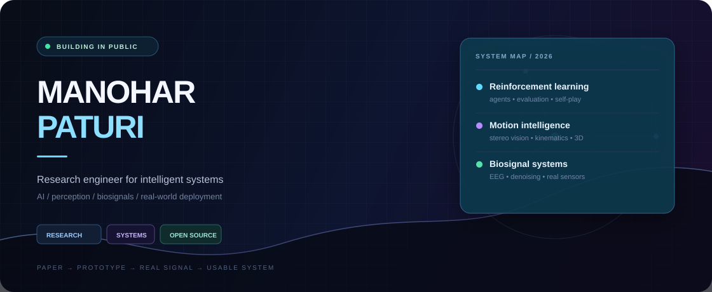
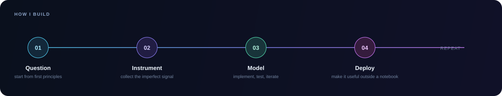

 

 

> **I build intelligent systems that have to agree with the world outside the notebook.**
>
> AI Engineering undergraduate at **Amrita Vishwa Vidyapeetham**, working across reinforcement learning, computer vision, motion capture, and EEG biosignals. My default mode is to follow an idea all the way from paper, to prototype, to real and imperfect input data.

## Selected work

<table>
  <tr>
    <td width="50%" valign="top">
      <h3><a href="https://github.com/ManoharPaturi/manu_mocap">mocapX1 ↗</a></h3>
      MARKERLESS MOTION INTELLIGENCE
        
      A full offline-first motion-capture pipeline: MediaPipe pose detection, stereo DLT triangulation, filtering, joint kinematics, and production-ready exports.
        
      <code>FastAPI</code> <code>React</code> <code>Three.js</code> <code>OpenCV</code>
    </td>
    <td width="50%" valign="top">
      <h3><a href="https://github.com/ManoharPaturi/TIC-TAC-TOE-Player-By-DOUBLE-DQN-MODEL">Self-play RL ↗</a></h3>
      AGENTS BUILT FROM FIRST PRINCIPLES
        
      A Tic-Tac-Toe agent trained through self-play with Double/Dueling DQN, NoisyNet exploration, and prioritized experience replay—paired with a minimax baseline.
        
      <code>PyTorch</code> <code>RL</code> <code>self-play</code>
    </td>
  </tr>
  <tr>
    <td width="50%" valign="top">
      <h3><a href="https://github.com/ManoharPaturi/D9_MFC4_SVD-BASED-NOISE-REDUCTION-IN-EEG-SIGNALS-">EEG denoising ↗</a></h3>
      BIOSIGNALS / LINEAR ALGEBRA
        
      SVD-based EOG artifact removal for real 14-channel Emotiv EPOC X recordings: separating noise structure from neural signal without pretending the data is clean.
        
      <code>MATLAB</code> <code>SVD</code> <code>EEG</code>
    </td>
    <td width="50%" valign="top">
      <h3><a href="https://github.com/ManoharPaturi/projX">projX ↗</a></h3>
      OFFLINE MOBILE COMPUTER VISION
        
      A mobile-first OMR evaluation workflow that runs entirely on device: capture, OpenCV bubble detection, answer-key matching, and exportable reports.
        
      <code>Flutter</code> <code>OpenCV</code> <code>on-device</code>
    </td>
  </tr>
</table>

[View all systems →](https://github.com/ManoharPaturi?tab=repositories)

## Open source field notes

I contribute the small, sharp improvements that make other people’s software better: fixes, accessibility work, documentation accuracy, and developer experience across AI frameworks, inference tooling, and systems libraries.

 

[Explore every upstream contribution →](https://github.com/pulls?q=is%3Apr+author%3AManoharPaturi)

## Toolkit

## Live signal

&nbsp;

  

  

 

### Let’s build something that has to work in the real world.

Designed as a living research log, not a résumé.

