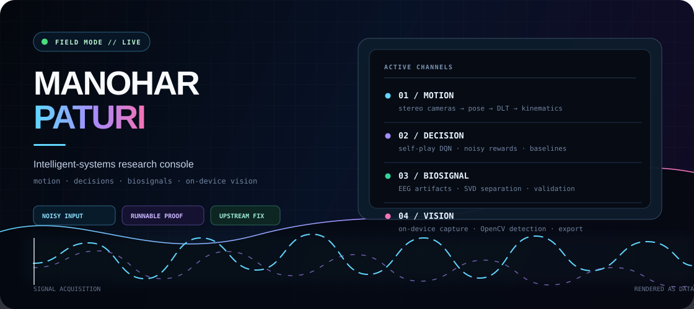
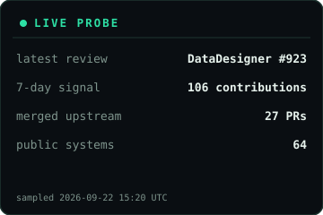
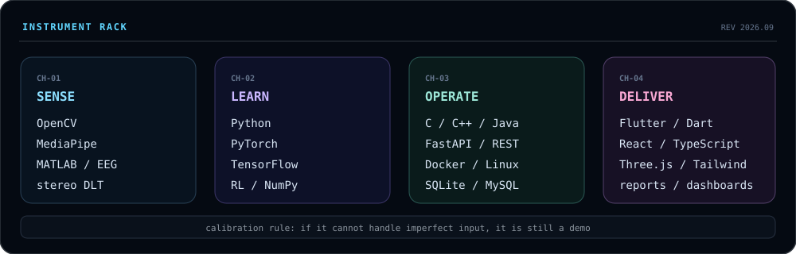

## Mission brief

<table>
  <tr>
    <td width="38%" valign="top">
      
    </td>
    <td width="62%" valign="top">
      <h3>Operator brief</h3>
      
I’m <strong>Manohar Paturi</strong>, an AI Engineering undergraduate at <strong>Amrita Vishwa Vidyapeetham</strong>. I don’t want models that only behave after the data has been politely cleaned. I build systems that meet cameras, electrodes, users, and imperfect inputs as they actually are.

      
<strong>Operating principles</strong>

      <ul>
        <li><strong>Instrument first.</strong> Understand what the sensor measures before choosing the model.</li>
        <li><strong>Keep a boring baseline.</strong> If minimax beats the fancy agent, the fancy agent hasn’t won.</li>
        <li><strong>Preserve failure evidence.</strong> The bad recordings and failed runs are part of the result.</li>
        <li><strong>Ship something runnable.</strong> A notebook is a lab bench, not the finished instrument.</li>
      </ul>
    </td>
  </tr>
</table>

## Case files

<b>CASE 01 · MOTION</b> — mocapX1

**Friction:** useful motion capture still looks like a laboratory setup: special suits, special cameras, special rooms.

**Approach:** connect two ordinary views through MediaPipe pose landmarks, triangulate with stereo DLT, filter the trajectory, and derive joint kinematics instead of stopping at landmarks.

**Proof:** an offline-first pipeline with live 3D inspection and motion-capture export formats.

<code>Python</code> <code>FastAPI</code> <code>React</code> <code>Three.js</code> <code>OpenCV</code>

[Open case file ↗](https://github.com/ManoharPaturi/mocap)

<b>CASE 02 · DECISIONS</b> — self-play reinforcement learning

**Friction:** “the agent learned something” is not evidence unless the learning is tested against a known-optimal opponent.

**Approach:** train a Double/Dueling DQN agent with NoisyNet exploration and prioritized experience replay, then confront it with self-play pressure and a minimax baseline.

**Proof:** the system exposes both the learned policy and the sanity check—not just the exciting score.

<code>Python</code> <code>PyTorch</code> <code>Reinforcement learning</code>

[Open case file ↗](https://github.com/ManoharPaturi/TIC-TAC-TOE-Player-By-DOUBLE-DQN-MODEL)

<b>CASE 03 · BIOSIGNALS</b> — EEG artifact recovery

**Friction:** real EEG is eye movement, muscle activity, electrode noise, and—somewhere in there—neural signal.

**Approach:** use SVD to separate low-rank artifact structure from the underlying 14-channel Emotiv EPOC X recordings rather than pretending the acquisition was sterile.

**Proof:** denoising treated as signal recovery, with the assumptions made visible.

<code>MATLAB</code> <code>SVD</code> <code>Signal processing</code>

[Open case file ↗](https://github.com/ManoharPaturi/D9_MFC4_SVD-BASED-NOISE-REDUCTION-IN-EEG-SIGNALS-)

<b>CASE 04 · ON-DEVICE VISION</b> — projX

**Friction:** document evaluation often becomes “upload everything to a server and wait.”

**Approach:** keep capture, bubble detection, answer-key comparison, and result export on the mobile device.

**Proof:** a complete workflow that works without a server round trip.

<code>Flutter</code> <code>Dart</code> <code>OpenCV</code>

[Open case file ↗](https://github.com/ManoharPaturi/projX)

[Open the full repository cabinet →](https://github.com/ManoharPaturi?tab=repositories)

## Upstream ship log

I contribute where a small, precise change removes a real developer paper-cut—then add the regression test or documentation correction that keeps it fixed.

<table>
  <tr>
    <td width="18%" valign="top">MERGED <b>AstryX</b></td>
    <td width="62%">Added an <code>elevation</code> prop to <code>ToggleButton</code>.</td>
    <td width="20%" align="right"><a href="https://github.com/facebook/astryx/pull/6037">PR #6037 ↗</a></td>
  </tr>
  <tr>
    <td valign="top">MERGED <b>LangChain</b></td>
    <td>Removed stale parameter and exception documentation from public APIs.</td>
    <td align="right"><a href="https://github.com/langchain-ai/langchain/pull/40211">PR #40211 ↗</a></td>
  </tr>
  <tr>
    <td valign="top">MERGED <b>MuJoCo</b></td>
    <td>Corrected misleading terminology in physics-engine reference docs.</td>
    <td align="right"><a href="https://github.com/google-deepmind/mujoco/pull/3550">PR #3550 ↗</a></td>
  </tr>
  <tr>
    <td valign="top">MERGED <b>Mistral AI</b></td>
    <td>Fixed an error in the experimental usage guide.</td>
    <td align="right"><a href="https://github.com/mistralai/mistral-common/pull/306">PR #306 ↗</a></td>
  </tr>
</table>

<b>ACTIVE REVIEW QUEUE</b>

- [NeMo Run — remove stray CLI debug output](https://github.com/NVIDIA-NeMo/Run/pull/611)
- [NeMo DataDesigner — tolerate literal braces in prompts](https://github.com/NVIDIA-NeMo/DataDesigner/pull/923)
- [vLLM — make ROCm <code>numactl</code> binding real](https://github.com/vllm-project/vllm/pull/55433)
- [Weaviate — correct <code>object_count</code> metric help text](https://github.com/weaviate/weaviate/pull/12951)
- [Claude Code Action — skip malformed buffered comment lines](https://github.com/anthropics/claude-code-action/pull/1797)

[Explore every upstream pull request →](https://github.com/pulls?q=is%3Apr+author%3AManoharPaturi)

## Instrument rack

## Telemetry

&nbsp;

 

### Bring me a signal that refuses to behave.

[Email](mailto:manoharpaturi777@gmail.com) · [LinkedIn](https://linkedin.com/in/manoharpaturi) · [Repositories](https://github.com/ManoharPaturi?tab=repositories)

A self-updating field log · telemetry regenerated nightly from public GitHub data.

