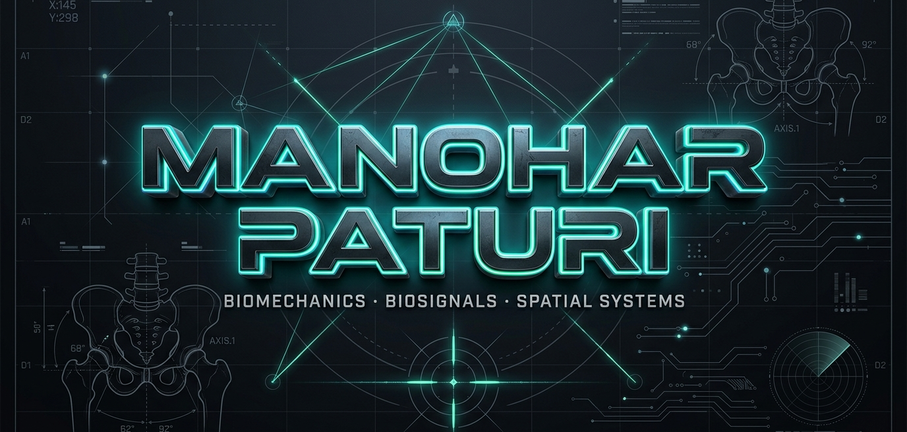
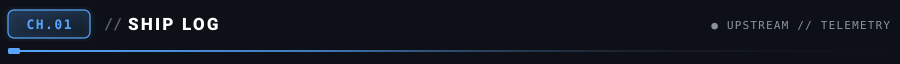
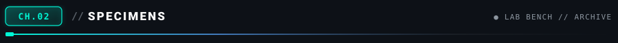
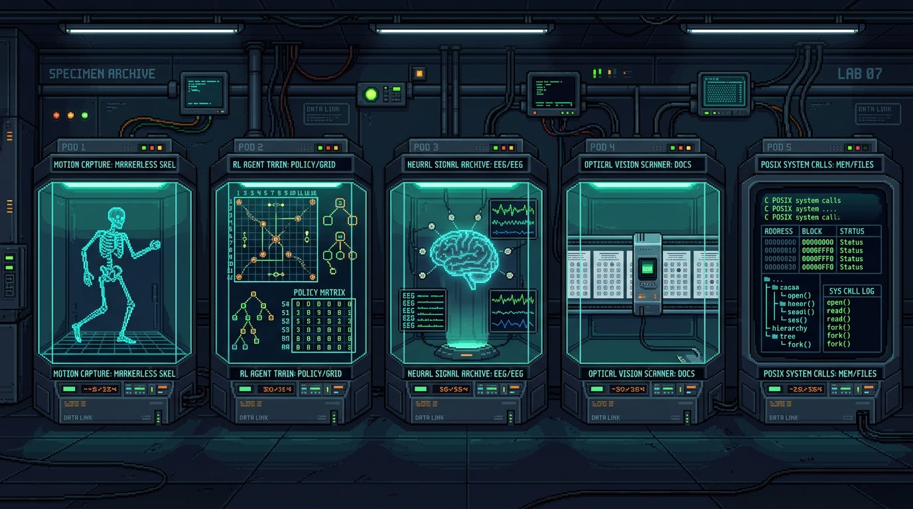
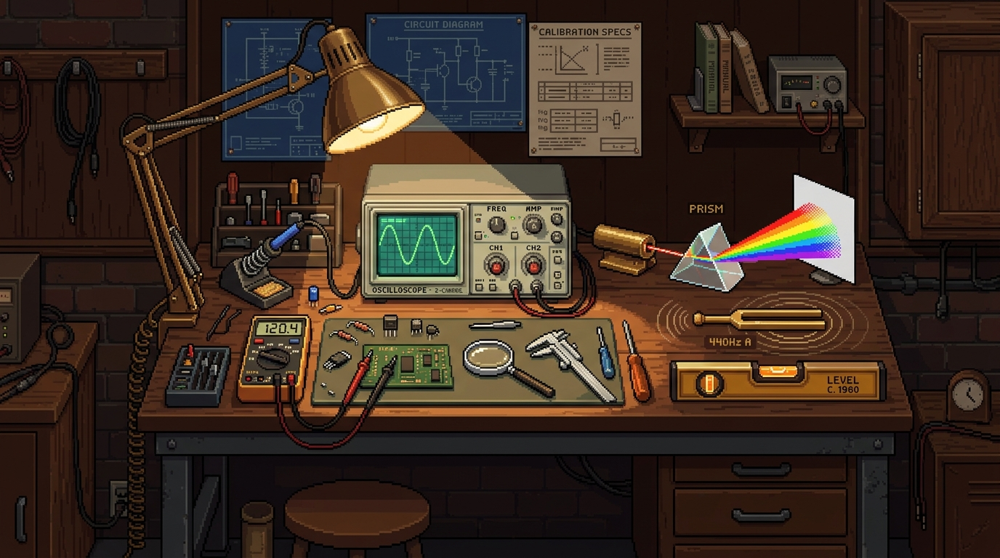
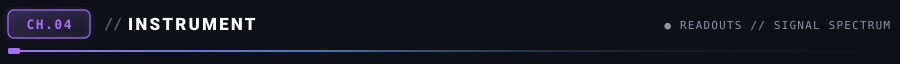
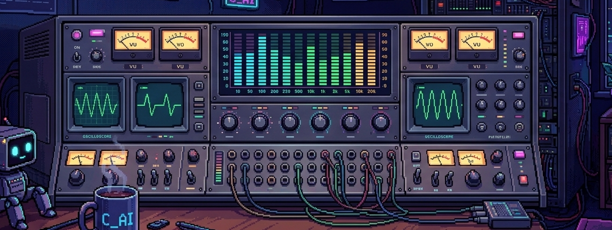
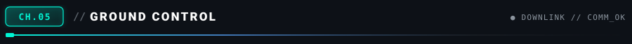
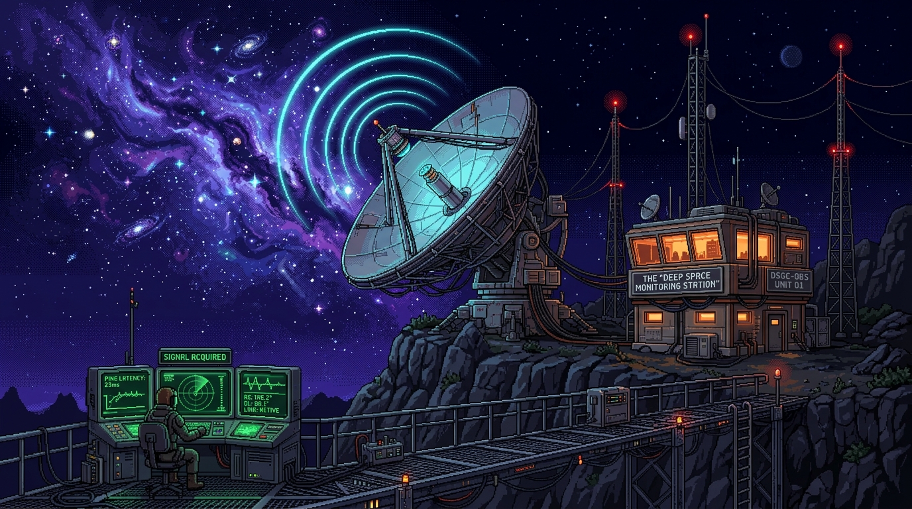
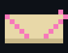

  

 

  

 

  

  
  &nbsp;
  
  &nbsp;
  

  <a href="#ship-log">Ship Log</a> &nbsp;•&nbsp;
  <a href="#specimens">Specimens</a> &nbsp;•&nbsp;
  <a href="#calibration">Calibration</a> &nbsp;•&nbsp;
  <a href="#instrument">Instrument</a> &nbsp;•&nbsp;
  <a href="#ground-control">Ground Control</a>

 

  

I build systems that meet cameras, electrodes, users, and imperfect inputs as they actually are — AI engineering undergrad @ Amrita Vishwa Vidyapeetham.

---

`gh pr list --author @me --state=all`

  

I contribute upstream where a small, precise change removes a real developer paper-cut — then add the regression test or documentation that keeps it fixed.

  

**accepted upstream**

| lab | what shipped | pr | state |
|-------|----------------|----|-------|
|  **NVIDIA** · [Curator](https://github.com/NVIDIA-NeMo/Curator) | treat `DocumentSplitter` separator as a literal string | [#2376](https://github.com/NVIDIA-NeMo/Curator/pull/2376) | 🟣 merged |
|  **NVIDIA** · [Megatron-Bridge](https://github.com/NVIDIA-NeMo/Megatron-Bridge) | in-process HashStore for `temporary_distributed_context` rendezvous | [#5989](https://github.com/NVIDIA-NeMo/Megatron-Bridge/pull/5989) | 🟣 merged |
|  **NVIDIA** · [Speech](https://github.com/NVIDIA-NeMo/Speech) | `SubsamplingReductionModule` pooling computes lengths for a single `MaxPool1d` pass | [#16226](https://github.com/NVIDIA-NeMo/Speech/pull/16226) | 🟣 merged |
|  **NVIDIA** · [Gym](https://github.com/NVIDIA-NeMo/Gym) | normalize native LiteLLM responses before NeMoGymResponse validation | [#3413](https://github.com/NVIDIA-NeMo/Gym/pull/3413) | 🟣 merged |
|  **NVIDIA** · [Gym](https://github.com/NVIDIA-NeMo/Gym) | distinguish Bird-SQL result mismatches and timeouts from execution failures in the evaluator | [#3468](https://github.com/NVIDIA-NeMo/Gym/pull/3468) | 🟣 merged |
|  **NVIDIA** · [Megatron-Bridge](https://github.com/NVIDIA-NeMo/Megatron-Bridge) | allow Energon native sequence packing with MTP in the data pipeline | [#5990](https://github.com/NVIDIA-NeMo/Megatron-Bridge/pull/5990) | 🟣 merged |
|  **Microsoft** · [agent-framework](https://github.com/microsoft/agent-framework) | handle `Literal` annotations in `is_instance_of` | [#8351](https://github.com/microsoft/agent-framework/pull/8351) | 🟣 merged |
|  **Microsoft** · agent-framework | preserve instruction order in `prepend_instructions_to_messages` dedup | [#8353](https://github.com/microsoft/agent-framework/pull/8353) | 🟣 merged |
|  **Microsoft** · agent-framework | accept int timeouts in the A2A agent | [#8516](https://github.com/microsoft/agent-framework/pull/8516) | 🟣 merged |
|  **Microsoft** · agent-framework | preserve dict subclasses in workflow checkpoints | [#8519](https://github.com/microsoft/agent-framework/pull/8519) | 🟣 merged |
|  **Microsoft** · agent-framework | case-insensitive User-Agent detection prevents duplicate headers | [#8521](https://github.com/microsoft/agent-framework/pull/8521) | 🟣 merged |
|  **Microsoft** · agent-framework | skip empty and whitespace-only instructions in `prepend` | [#8524](https://github.com/microsoft/agent-framework/pull/8524) | 🟣 merged |
|  **Microsoft** · agent-framework | allow text events when `response_format` is a json schema dictionary | [#8604](https://github.com/microsoft/agent-framework/pull/8604) | 🟣 merged |
|  **Microsoft** · agent-framework | match empty expected tool call arguments when actual call arguments are `None` | [#8609](https://github.com/microsoft/agent-framework/pull/8609) | 🟣 merged |
|  **Microsoft** · agent-framework | narrow pytest.raises blocks to wrap only `get_response` in error tests | [#8611](https://github.com/microsoft/agent-framework/pull/8611) | 🟣 merged |
|  **Microsoft** · agent-framework | ensure `add_usage_details` returns copies and skips booleans | [#8613](https://github.com/microsoft/agent-framework/pull/8613) | 🟣 merged |
|  **Microsoft** · agent-framework | fix positional invocations in `detect_media_type_from_base64` docstrings | [#8614](https://github.com/microsoft/agent-framework/pull/8614) | 🟣 merged |
|  **Microsoft** · [PyRIT](https://github.com/microsoft/PyRIT) | restore keyboard focus to launch button on preview dismissal | [#2686](https://github.com/microsoft/PyRIT/pull/2686) | 🟣 merged |
|  **Meta** · [astryx](https://github.com/facebook/astryx) | `elevation` prop for `ToggleButton` — survived Meta's full design-system review loop | [#6037](https://github.com/facebook/astryx/pull/6037) | 🟣 merged |
|  **Meta** · astryx | guard `TextInput.onEnter` against Japanese-IME conversion commits | [#6083](https://github.com/facebook/astryx/pull/6083) | 🟣 merged |
|  **Meta** · astryx | scope the 16px input font floor to iOS only | [#6085](https://github.com/facebook/astryx/pull/6085) | 🟣 merged |
|  **Google DeepMind** · [mujoco](https://github.com/google-deepmind/mujoco) | corrected misleading terminology in the physics-engine reference docs | [#3550](https://github.com/google-deepmind/mujoco/pull/3550) | 🟣 merged |
|  **LangChain** · [langchain](https://github.com/langchain-ai/langchain) | removed stale `Args` / `Raises` docstrings from core public APIs | [#40211](https://github.com/langchain-ai/langchain/pull/40211) | 🟣 merged |
|  **Mistral AI** · [mistral-common](https://github.com/mistralai/mistral-common) | fixed an error in the experimental usage guide | [#306](https://github.com/mistralai/mistral-common/pull/306) | 🟣 merged |

**in review — 60 signals awaiting a verdict**

| lab | what i shipped | pr | state |
|-------|----------------|----|-------|
|  **NVIDIA** · [DataDesigner](https://github.com/NVIDIA-NeMo/DataDesigner) | don't crash prompt validation on literal braces (valid Jinja text) | [#923](https://github.com/NVIDIA-NeMo/DataDesigner/pull/923) | 🟢 open |
|  **Meta** · [astryx](https://github.com/facebook/astryx) | fix(Markdown): reject all data: schemes in parser isSafeUrl (#6323) | [#6355](https://github.com/facebook/astryx/pull/6355) | 🟢 open |
|  **Microsoft** · [agent-framework](https://github.com/microsoft/agent-framework) | break get_latest timestamp ties with the checkpoint lineage chain | [#8514](https://github.com/microsoft/agent-framework/pull/8514) | 🟢 open |
|  **OpenAI** · [openai-agents-js](https://github.com/openai/openai-agents-js) | fix(sandbox): trim sandbox metadata and workspace paths in linear time | [#1916](https://github.com/openai/openai-agents-js/pull/1916) | 🟢 open |
|  **Anthropic** · [claude-code-action](https://github.com/anthropics/claude-code-action) | use job url origin for branch link so GitHub Enterprise Server works | [#1844](https://github.com/anthropics/claude-code-action/pull/1844) | 🟢 open |
|  **Weaviate** · [weaviate](https://github.com/weaviate/weaviate) | fix(groupBy): correct minDistance and maxDistance in multi-shard merge and hybrid search (#13108) | [#13131](https://github.com/weaviate/weaviate/pull/13131) | 🟢 open |
|  **deepset** · [haystack](https://github.com/deepset-ai/haystack) | resolve cross-batch write-write conflicts by LLM call order in tool scheduling | [#12628](https://github.com/deepset-ai/haystack/pull/12628) | 🟢 open |
|  **Microsoft** · [markitdown](https://github.com/microsoft/markitdown) | feat(ipynb): render code cell outputs (streams, errors, text results) | [#2534](https://github.com/microsoft/markitdown/pull/2534) | 🟢 open |
|  **NVIDIA** · [Speech](https://github.com/NVIDIA-NeMo/Speech) | fix(asr): repair ConvSubsampling forward paths missed by the MaskedConvSequential refactor | [#16225](https://github.com/NVIDIA-NeMo/Speech/pull/16225) | 🟢 open |
|  **vLLM** · [vllm](https://github.com/vllm-project/vllm) | Install numactl in ROCm images so --numa-bind is not a silent no-op | [#55433](https://github.com/vllm-project/vllm/pull/55433) | 🟢 open |

<b>rest of the board</b> — 50 more across astryx, NeMo (Curator/Gym/Speech/Run/Bridge), markitdown, semantic-kernel, claude-code-action, autogen, ollama, weaviate, comfyui, mujoco, datasets, presidio, aws-cdk, lm-eval-harness

| lab | what i shipped | pr | state |
|-------|----------------|----|-------|
|  [facebook/astryx](https://github.com/facebook/astryx) | docs(input fields): align statusVariant documentation and test coverage | [#6428](https://github.com/facebook/astryx/pull/6428) | 🟢 open |
|  [facebook/astryx](https://github.com/facebook/astryx) | fix(Tokenizer): suppress Create when the typed label matches a selected token | [#6367](https://github.com/facebook/astryx/pull/6367) | 🟢 open |
|  [facebook/astryx](https://github.com/facebook/astryx) | fix(TextInput): dispatch changeAction and update optimistic value on clear | [#6425](https://github.com/facebook/astryx/pull/6425) | 🟢 open |
|  [data-privacy-stack/presidio](https://github.com/data-privacy-stack/presidio) | fix(analyzer): keep Stanza multi-word tokens as surface tokens to preserve text and entity offsets | [#2253](https://github.com/data-privacy-stack/presidio/pull/2253) | 🟢 open |
|  [facebook/astryx](https://github.com/facebook/astryx) | fix(Markdown): preserve list structure for mixed task and bullet lists (#6330) | [#6424](https://github.com/facebook/astryx/pull/6424) | 🟢 open |
|  [NVIDIA-NeMo/Curator](https://github.com/NVIDIA-NeMo/Curator) | fix(utils): split_large_files RecursionError on single row larger than target size | [#2377](https://github.com/NVIDIA-NeMo/Curator/pull/2377) | 🟢 open |
|  [NVIDIA-NeMo/Gym](https://github.com/NVIDIA-NeMo/Gym) | fix(cli): pass config dict via process environment instead of command line (#3383) | [#3472](https://github.com/NVIDIA-NeMo/Gym/pull/3472) | 🟢 open |
|  [facebook/astryx](https://github.com/facebook/astryx) | fix(FileInput): dispatch changeAction and update optimistic value on clear and selection | [#6427](https://github.com/facebook/astryx/pull/6427) | 🟢 open |
|  [facebook/astryx](https://github.com/facebook/astryx) | fix(ChatComposerInput): anchor programmatic carets into trailing text nodes for IME composition (#6411) | [#6423](https://github.com/facebook/astryx/pull/6423) | 🟢 open |
|  [facebook/astryx](https://github.com/facebook/astryx) | fix(Calendar): compute ISO week numbers without local DST offset leaking in | [#6365](https://github.com/facebook/astryx/pull/6365) | 🟢 open |
|  [facebook/astryx](https://github.com/facebook/astryx) | render plain Link anchors inline so an ancestor Text clamp can truncate them | [#6038](https://github.com/facebook/astryx/pull/6038) | 🟢 open |
|  [facebook/astryx](https://github.com/facebook/astryx) | floor SegmentedControlItem to a 44px touch target on coarse pointers | [#6084](https://github.com/facebook/astryx/pull/6084) | 🟢 open |
|  [microsoft/markitdown](https://github.com/microsoft/markitdown) | fix(rss): emit item and entry links as heading anchors | [#2525](https://github.com/microsoft/markitdown/pull/2525) | 🟢 open |
|  [microsoft/markitdown](https://github.com/microsoft/markitdown) | keep whitespace inside fenced code blocks when normalizing results | [#2529](https://github.com/microsoft/markitdown/pull/2529) | 🟢 open |
|  [microsoft/markitdown](https://github.com/microsoft/markitdown) | fix(xlsx): render float values faithfully instead of 6-digit scientific notation | [#2533](https://github.com/microsoft/markitdown/pull/2533) | 🟢 open |
|  [microsoft/markitdown](https://github.com/microsoft/markitdown) | fix(docx): clamp Word Heading 7-9 to markdown h6 | [#2531](https://github.com/microsoft/markitdown/pull/2531) | 🟢 open |
|  [microsoft/semantic-kernel](https://github.com/microsoft/semantic-kernel) | keep quoted named-arg values as single tokens in CodeTokenizer | [#14461](https://github.com/microsoft/semantic-kernel/pull/14461) | 🟢 open |
|  [microsoft/markitdown](https://github.com/microsoft/markitdown) | fix(pptx): render missing chart data points as empty cells | [#2527](https://github.com/microsoft/markitdown/pull/2527) | 🟢 open |
|  [microsoft/semantic-kernel](https://github.com/microsoft/semantic-kernel) | apply input_variables defaults when rendering prompt templates | [#14459](https://github.com/microsoft/semantic-kernel/pull/14459) | 🟢 open |
|  [anthropics/claude-code-action](https://github.com/anthropics/claude-code-action) | render actual text of failing MCP tool results in step summary | [#1842](https://github.com/anthropics/claude-code-action/pull/1842) | 🟢 open |
|  [anthropics/claude-code-action](https://github.com/anthropics/claude-code-action) | keep "=" in PR link query values and encode path spaces | [#1840](https://github.com/anthropics/claude-code-action/pull/1840) | 🟢 open |
|  [NVIDIA-NeMo/Speech](https://github.com/NVIDIA-NeMo/Speech) | fix(speechlm2): preserve relocated EOS token during early interruption augmentation | [#16268](https://github.com/NVIDIA-NeMo/Speech/pull/16268) | 🟢 open |
|  [Comfy-Org/ComfyUI](https://github.com/Comfy-Org/ComfyUI) | Repair mask editor painted-masked uploads so the original image survives under the mask | [#16141](https://github.com/Comfy-Org/ComfyUI/pull/16141) | 🟢 open |
|  [aws/aws-cdk](https://github.com/aws/aws-cdk) | docs(core): drop stale `sep` reference from `ArnComponents.arnFormat` default docs | [#38775](https://github.com/aws/aws-cdk/pull/38775) | 🟢 open |
|  [NVIDIA-NeMo/DataDesigner](https://github.com/NVIDIA-NeMo/DataDesigner) | fix(compiler): support columns_added and columns_removed in processor config (#394) | [#943](https://github.com/NVIDIA-NeMo/DataDesigner/pull/943) | 🟢 open |
|  [NVIDIA-NeMo/Run](https://github.com/NVIDIA-NeMo/Run) | fix(cli): resolve string and future annotations in cli parser (#374) | [#613](https://github.com/NVIDIA-NeMo/Run/pull/613) | 🟢 open |
|  [microsoft/autogen](https://github.com/microsoft/autogen) | fix(autogen-ext): fix __unknown_models set difference and outdated docstrings (#8243) | [#8246](https://github.com/microsoft/autogen/pull/8246) | 🟢 open |
|  [anthropics/claude-code-action](https://github.com/anthropics/claude-code-action) | fix(mcp): support symbolic links with mode 120000 and target path content | [#1837](https://github.com/anthropics/claude-code-action/pull/1837) | 🟢 open |
|  [NVIDIA-NeMo/Megatron-Bridge](https://github.com/NVIDIA-NeMo/Megatron-Bridge) | fix(ckpt): pass requested revision to snapshot_download in SafeTensorsStateSource | [#6109](https://github.com/NVIDIA-NeMo/Megatron-Bridge/pull/6109) | 🟢 open |
|  [NVIDIA-NeMo/Megatron-Bridge](https://github.com/NVIDIA-NeMo/Megatron-Bridge) | fix(tokenizer): respect offline mode and local_files_only in _resolve_hf_tokenizer_revision | [#6111](https://github.com/NVIDIA-NeMo/Megatron-Bridge/pull/6111) | 🟢 open |
|  [microsoft/semantic-kernel](https://github.com/microsoft/semantic-kernel) | use field description over pydantic constraint objects in schema builder | [#14444](https://github.com/microsoft/semantic-kernel/pull/14444) | 🟢 open |
|  [microsoft/semantic-kernel](https://github.com/microsoft/semantic-kernel) | fix kernel_function decorator mutating shared Annotated metadata dicts | [#14442](https://github.com/microsoft/semantic-kernel/pull/14442) | 🟢 open |
|  [microsoft/markitdown](https://github.com/microsoft/markitdown) | fix(xlsx): keep integer rendering when a blank cell promotes a column to float | [#2485](https://github.com/microsoft/markitdown/pull/2485) | 🟢 open |
|  [microsoft/markitdown](https://github.com/microsoft/markitdown) | fix(html): keep head metadata out of markdown without dropping stray content | [#2483](https://github.com/microsoft/markitdown/pull/2483) | 🟢 open |
|  [NVIDIA-NeMo/Run](https://github.com/NVIDIA-NeMo/Run) | fix(cli): remove stray "Configuring global options" debug print | [#611](https://github.com/NVIDIA-NeMo/Run/pull/611) | 🟢 open |
|  [NVIDIA-NeMo/Run](https://github.com/NVIDIA-NeMo/Run) | fix(cli): forward entrypoint skip_confirmation to the generated command | [#609](https://github.com/NVIDIA-NeMo/Run/pull/609) | 🟢 open |
|  [NVIDIA-NeMo/Run](https://github.com/NVIDIA-NeMo/Run) | fix(cli): handle unparameterized list/dict annotations in value parser | [#607](https://github.com/NVIDIA-NeMo/Run/pull/607) | 🟢 open |
|  [NVIDIA-NeMo/Run](https://github.com/NVIDIA-NeMo/Run) | fix(cli): only treat delimited run/executor/plugins prefixes as overwrites | [#605](https://github.com/NVIDIA-NeMo/Run/pull/605) | 🟢 open |
|  [EleutherAI/lm-evaluation-harness](https://github.com/EleutherAI/lm-evaluation-harness) | Fix typos in task documentation (16 files) | [#4102](https://github.com/EleutherAI/lm-evaluation-harness/pull/4102) | 🟢 open |
|  [microsoft/PyRIT](https://github.com/microsoft/PyRIT) | FEAT: Add Garak exploitation scenario (Jinja template injection + SQL injection echo) | [#2576](https://github.com/microsoft/PyRIT/pull/2576) | 🟢 open |
|  [weaviate/weaviate](https://github.com/weaviate/weaviate) | add rq-4 to ALLOWED_COMPRESSION_TYPES valid entries | [#12950](https://github.com/weaviate/weaviate/pull/12950) | 🟢 open |
|  [weaviate/weaviate](https://github.com/weaviate/weaviate) | Fix object_count metric Help text (copy-pasted from async_operations_running) | [#12951](https://github.com/weaviate/weaviate/pull/12951) | 🟢 open |
|  [huggingface/datasets](https://github.com/huggingface/datasets) | Fix typo in guide template | [#8567](https://github.com/huggingface/datasets/pull/8567) | 🟢 open |
|  [microsoft/autogen](https://github.com/microsoft/autogen) | fix typos across documentation (16 files) | [#8196](https://github.com/microsoft/autogen/pull/8196) | 🟢 open |
|  [ollama/ollama](https://github.com/ollama/ollama) | log: report the source of the loaded context length | [#18249](https://github.com/ollama/ollama/pull/18249) | 🟢 open |
|  [ollama/ollama](https://github.com/ollama/ollama) | normalize escaped pattern literals in tool/format schemas passed to llama-server | [#18248](https://github.com/ollama/ollama/pull/18248) | 🟢 open |
|  [microsoft/autogen](https://github.com/microsoft/autogen) | fix(ext): reject stale hunks in TextCanvas.apply_patch with context validation | [#8195](https://github.com/microsoft/autogen/pull/8195) | 🟢 open |
|  [google-deepmind/mujoco](https://github.com/google-deepmind/mujoco) | Fix inconsistent axis labels in solimp documentation figures | [#3548](https://github.com/google-deepmind/mujoco/pull/3548) | 🟢 open |
|  [anthropics/claude-code-action](https://github.com/anthropics/claude-code-action) | skip malformed buffered inline comment lines instead of failing the post step | [#1797](https://github.com/anthropics/claude-code-action/pull/1797) | 🟢 open |
|  [anthropics/claude-code-action](https://github.com/anthropics/claude-code-action) | only extract the user request from word-boundary trigger occurrences | [#1799](https://github.com/anthropics/claude-code-action/pull/1799) | 🟢 open |

[explore every upstream pull request →](https://github.com/pulls?q=is%3Apr+author%3AManoharPaturi)

---

`ls ~/lab/specimens`

  

| case | friction | approach | proof | stack |
|------|----------|----------|-------|-------|
| [**SPX-01 · MOTION**](https://github.com/ManoharPaturi/mocap) *markerless motion capture* | useful mocap lives in laboratories — special suits, special cameras, special rooms | two ordinary camera views → MediaPipe landmarks → stereo DLT triangulation → filtering → joint kinematics | offline-first pipeline, live 3D inspection, real mocap export formats | `Python` `FastAPI` `React` `Three.js` `OpenCV` |
| [**SPX-02 · DECISIONS**](https://github.com/ManoharPaturi/TIC-TAC-TOE-Player-By-DOUBLE-DQN-MODEL) *self-play reinforcement learning* | "the agent learned something" isn't evidence until tested against a known-optimal opponent | Double/Dueling DQN + NoisyNet + prioritized replay, pressured by self-play and a minimax baseline | ships both the learned policy and the sanity check — not just the score | `Python` `PyTorch` `RL` |
| [**SPX-03 · BIOSIGNALS**](https://github.com/ManoharPaturi/D9_MFC4_SVD-BASED-NOISE-REDUCTION-IN-EEG-SIGNALS-) *EEG artifact recovery* | real EEG is eye movement, muscle noise, electrode drift — and somewhere in there, the signal | SVD separates low-rank artifact structure from 14-channel Emotiv EPOC X recordings | denoising as signal recovery, with the assumptions visible | `MATLAB` `SVD` `signal processing` |
| [**SPX-04 · ON-DEVICE VISION**](https://github.com/ManoharPaturi/projX) *projX OMR grading* | document evaluation usually becomes "upload everything and wait" | capture, bubble detection, key comparison and export all stay on the phone | a complete grading workflow with zero server round trips | `Flutter` `Dart` `OpenCV` |
| [**SPX-05 · SYSTEMS**](https://github.com/ManoharPaturi/File-Management-System-Using-Basic-System-Calls-in-C) *POSIX file manager* | abstractions hide what the machine actually does | built directly on raw POSIX system calls — every operation mapped to its syscall boundary | know what's underneath your abstractions | `C` `POSIX` `system calls` |

`cat calibration.md`

  

> Build it from scratch at least once — the magic disappears, the understanding stays.
>
> If you can't reproduce it, you don't understand it yet.
>
> Real data over clean examples — messy input teaches what tutorials hide.
>
> Know what's underneath your abstractions. They all leak eventually.

---

`./bench --readings`

  

&nbsp;

  

---

`ping manohar`

  

 

### Bring me a signal that refuses to behave.

[ **Email**](mailto:manoharpaturi777@gmail.com) &nbsp;·&nbsp; [ **LinkedIn**](https://linkedin.com/in/manoharpaturi) &nbsp;·&nbsp; [ **Repositories**](https://github.com/ManoharPaturi?tab=repositories)

 

a self-updating instrument · telemetry regenerated nightly from public GitHub data · visual telemetry designed for high-assurance biosignals and spatial systems

